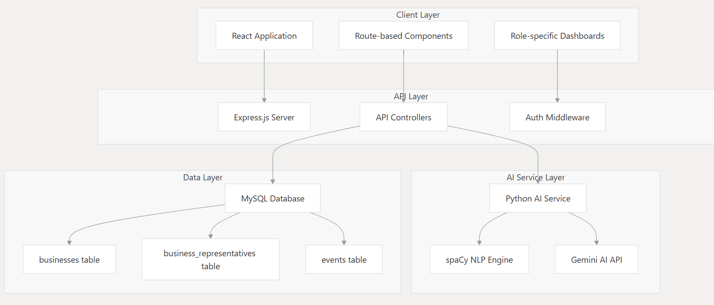

# B2B Platform for Technology Events - Internship Report

## Overview
This document presents a comprehensive summary of my first-year internship , where I developed a **B2B platform for technology events**. My primary focus was on designing and implementing key functionalities to streamline event management and enhance networking among participants.

## High Level Software Architecture

||
|:------------------------------------:|

## Key Features Developed
- **Organizer Account Management**: Designed an account system granting organizers administrative control over other accounts.
- **Company and Representative Management**: Provided functionalities for organizers to add, update, or remove companies and their representatives.
- **Intelligent Matchmaking System**: Implemented an advanced matchmaking system to foster meaningful professional connections.
- **Event Statistics and Insights**: Enabled organizers to access in-depth statistics on participating companies and representatives.
- **Notification System**: Developed a robust communication system for sending notifications to participants.

## Matchmaking System
The platform integrates an intelligent matchmaking system aimed at optimizing participant interactions through:
- **Natural Language Processing (NLP)**: Utilized NLP techniques to analyze participant profiles and preferences.
- **GEMINI API Integration**: Implemented the GEMINI API to enhance the relevance and accuracy of matchmaking recommendations.

## Project Scope
My contributions spanned the entire software development lifecycle:
1. **Requirements Analysis**: Identified system needs and defined core functionalities.
2. **System Design**: Developed UML diagrams, database structures, and the overall platform architecture.
3. **Implementation**: Built and integrated key features using modern web technologies.
4. **Testing & Optimization**: Conducted extensive testing to improve system performance and matchmaking precision.

## Conclusion
This internship provided valuable hands-on experience in **full-stack development**, **AI-driven matchmaking**, and **event management solutions**. The project successfully revolutionized how companies and representatives connect during technology events, making networking more efficient and data-driven.

---
## Project Demo
To explore the project in action, visit the EventIt demo - [EvenIt Demo Video](https://drive.google.com/file/d/1T_zguPbQmBWmJbPWdPR9n7nZEIrNGfWA/view?usp=sharing).
